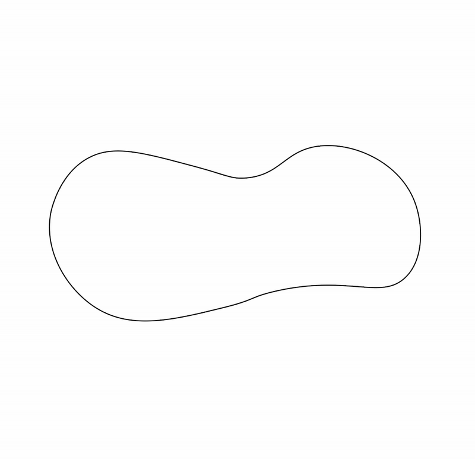
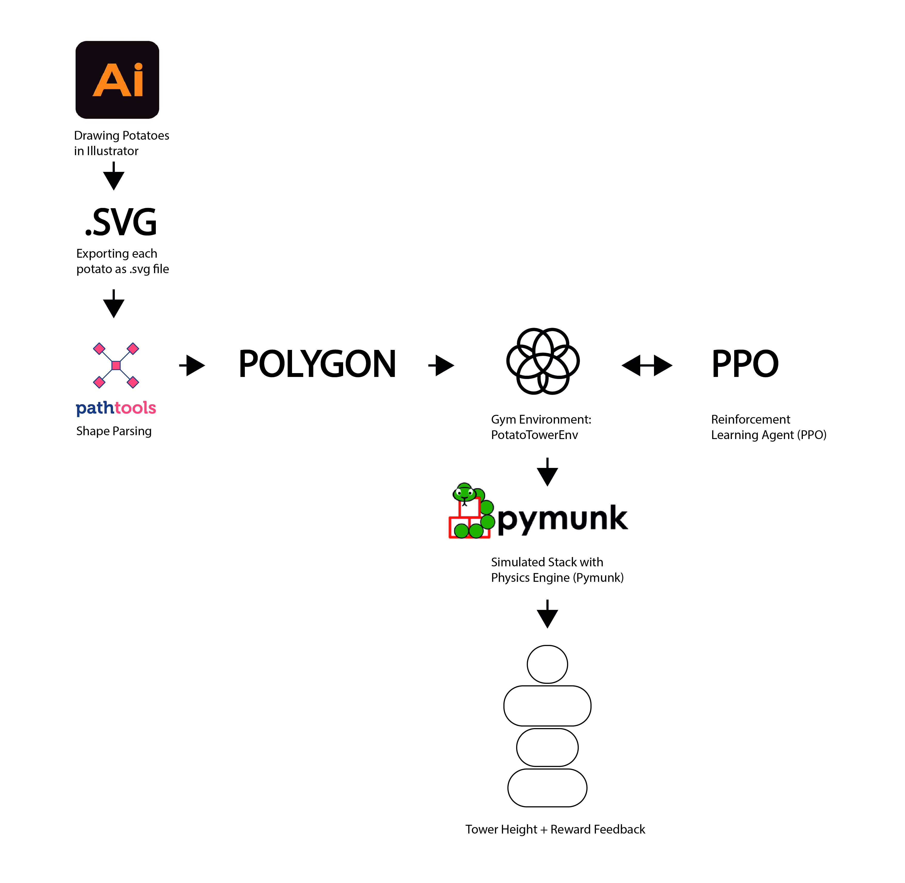
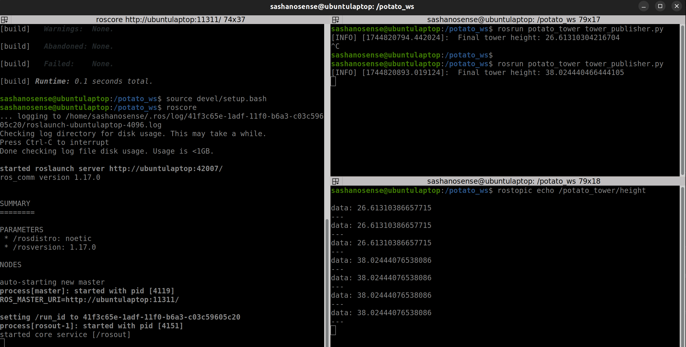

# Potato Tower Builder: AI-Driven Robotic Stacking Simulation

This repository combines Reinforcement Learning and ROS integration for a physical simulation of robotic stacking




---
---
---

# Index

### I - [Project Summary](#i-project-summary)

[Concept & Architecture](#4-concept-of-operations--block-diagram)

[Software Stack](#5-software-stack--tools-used)

[ML Expectations](#6-expectations-of-ml)

[Data & Simulation](#7-where-do-we-get-data)

[Testing Strategy](#8-how-do-we-test-how-do-we-simulate)

[Results & Evaluation](#9-interpretation-of-results)

### II - [Run the Project](#12-how-to-run-the-project)

### III - [Run with ROS](#iii-run-with-ros)

### IV - [Recap](#iv-recap)

---
---
---


# I Project Summary

## 1. What is this?
This project simulates a robotic system that learns how to build the highest possible tower using irregularly-shaped potato-like objects. The system uses reinforcement learning - [PPO](https://medium.com/@danushidk507/ppo-algorithm-3b33195de14a) to discover optimal stacking strategies within physical constraints, implemented in a custom [Gymnasium](https://gymnasium.farama.org/index.html) environment using [Pymunk](https://www.pymunk.org/en/latest/) physics and potato shapes extracted from SVG files.

## 2. Why?
The project investigates how machine learning can assist in robotic fabrication tasks, specifically in the domain of stacking unstable or uniquely shaped components. It showcases the capability of learning-based systems to replace or augment deterministic stacking rules, relevant in adaptive manufacturing, waste material reuse, or post-demolition reconstruction.

## 3. How?
We define a simulation environment where a robot must:
- Pick a potato (once per episode)
- Rotate it to the right orientation
- Stack it on top of the previous potato

The simulation provides reward feedback based on stack height and stability. The agent trains via [Proximal Policy Optimization (PPO)](https://medium.com/@danushidk507/ppo-algorithm-3b33195de14a) to maximize the final tower height and earn rewards based on full shape usage, successful stacking, and base-only ground contact.

---

## 4. Concept of Operations & Block Diagram



---

**ML Contribution:**
> The PPO Agent replaces traditional placement rules by learning optimal stacking angles — improving height and stability (the arrow from environment to RL agent).

**Why PPO?**

1. Why not q-table?

Environment is too complex for Q-table. Q-learning stores a table of state-action values, but this only works if the number of states and actions is very small.

In potato tower each observation includes continuous values like x/y positions, angles, tower height.

State space is huge and continuous — so a Q-table would be:
- Impossibly large
- Inaccurate due to discretization
- Not scalable

2. Why not DQN (Deep Q-Networks)?

DQN is a deep-learning version of Q-learning, but:

- It struggles with continuous action spaces
- PPO naturally handles discrete or continuous actions

Poatato Tower environment is sequential, physics-based, and better suited to PPO’s way of learning policies over time

3. PPO handles continuous & high-dimensional input

- PPO uses neural networks as function approximators.
- It learns from high-dimensional, continuous observation spaces.
- It can generalize across many similar states.

It works well for environments like potato tower, where:

- Potatoes are stacked one after another
- There’s physics simulation with real-valued states

---

## 5. Software Stack & Tools Used

- `Python 3.10`
- `gymnasium` for environment structure
- `pymunk` for physics-based simulation
- `pygame` for real-time rendering
- `svgpathtools` & `shapely` for shape processing
- `Stable-Baselines3` for PPO agent

### Communication:
All components are connected via Python scripts. Shapes are read from SVG files, passed to the Gym environment as polygonal data, and the PPO agent communicates with the environment through the Gym interface.

---

## 6. Expectations of ML

The RL agent is expected to:
- Use **all 5 potato shapes** exactly once
- Learn to **rotate and stack** them to maximize height
- Place only the **first potato on the ground**, rest on top
- Build a **stable tower** without collapse

---

## 7. Where do we get data?

Data is **synthetically generated** from:
- A directory of manually designed SVG potato shapes (`svg_01/`)
- These are preprocessed into geometric polygon shapes

The rest of the environment is physics-based, so training data comes from simulated rollouts.

---

## 8. How do we test? How do we simulate?

- Testing is done by running trained PPO models in `human` render mode.
- Simulations are run with `Pymunk`, providing real-time physics evaluation of each placement.
- Tower height, collision validation, and success/failure flags are printed at each step.

---

## 9. Interpretation of Results

### Results
- Models successfully learned to use all 5 potatoes and build towers consistently.
- Best tower heights reach over **35-37 px**, with all reward criteria met.

### Did it work?
Yes — the trained agents learn stacking strategies that result in:
- Proper alignment
- Centered balance
- Full usage of shapes

### What didn’t work?
- Occasionally, invalid placements (e.g., angle too sharp) cause collapse
- Limited generalization to unseen shapes

---

## 10. Future Steps & Improvements

- Improve physical modeling for mass/weight stability (center of mass)
- Extend to 3D tower building using real robotic arm simulation (e.g. PyBullet)
- Introduce transfer learning to adapt stacking across different shape datasets
- Include shape-specific affordances (e.g., flat surfaces preferred for stacking)

---

## Summary

This project demonstrates an interactive, physics-aware, reinforcement learning environment for robotic stacking. It is a prototype for applying ML in fabrication tasks where shape irregularity, stability, and strategic rotation are critical to success.

---

# II Project Run

## 11. Folder structure

```bash
potatoes/
├── models/
│   └── ppo_potato                # Trained PPO model
├── svg_01/
│   └── potato_01.svg ...         # SVG shapes of potatoes
├── src/
│   ├── potatoes.py               # Custom Gym environment
│   ├── potatoes_train.py         # Training script using PPO
│   └── potatoes_evaluate.py      # Script to evaluate trained model
├── README.md
├── requirements.txt              # Python Libraries, you need to run the script
└── extra_media/                  # Some images and gifs for the README.md file
```

## 12. How to run the project

1. Fork and Clone (git clone [link to the forked repository]) this repository
2. Navigate to the folder on your machine
3. Create and activate the virtual environment

``` bash
# Create virtual environment
python -m venv .venv

# Activate (on Windows)
.venv\Scripts\activate

# Or on macOS/Linux
source .venv/bin/activate
```
4. Install Dependencies

``` bash
pip install -r requirements.txt
``` 

5. Train a model

``` bash
cd src
python potatoes_train.py
``` 

6. Evaluate the trained model

``` bash
cd src
python potatoes_evaluate.py
```

# III Run with ROS

## 13. Build ROS-Compatible Docker Image


```bash
chmod +x .docker/build_image.sh
chmod +x .docker/run_user.sh
```

## 14. Update your bashrc

```bash
code ~/.bashrc
```

Add this in the end of the file

if [ -f "/potato_ws/setup.bash" ]; then
    source /potato_ws/setup.bash
fi

## 15. Build and run the docker image

```bash
.docker/build_image.sh
.docker/run_user.sh
```

than: 

```bash
sudo chown -R sashanosense /dev_ws
terminator 
```

## 16. Start VS Code

in vscode -> docker -> right mouse click on the runnin image -> attach vs code -> open folder [/potato_ws/src/]

here you can update/create ros packages using catkin make


## 17. To recieve the publishing:

in terminator:

```bash
cd src
roscore 
```

split the terminator in two

```bash
rosrun potato_tower tower_publisher.py
```

Result: will see smth like [INFO] [1744820794.442024]:  Final tower height: 26.61310304216704

to verify it is working: rostopic echo /potato_tower/height

your screen should look like this: 


# IV Recap

This repository combines Reinforcement Learning and ROS integration for a physical simulation of robotic stacking:

- A PPO-trained agent learns optimal stacking in a custom Gymnasium + Pymunk environment.
- Shapes are SVG-based and physics-simulated in real-time.
- The environment rewards height, center alignment, and stable contact.
- The final model can be evaluated, and its output (tower height) is published as a ROS topic from inside a Dockerized ROS Noetic container running Python 3.10.
- This makes it suitable for robotic fabrication research, prototyping of adaptive assembly strategies, or learning-based planning with irregular materials.


### Authors
[Aleksandra Kraeva](https://github.com/sashakraeva)

### Acknowledgements
- [Marita Georganta](https://www.linkedin.com/in/marita-georganta/) - Robotic Sensing Expert
